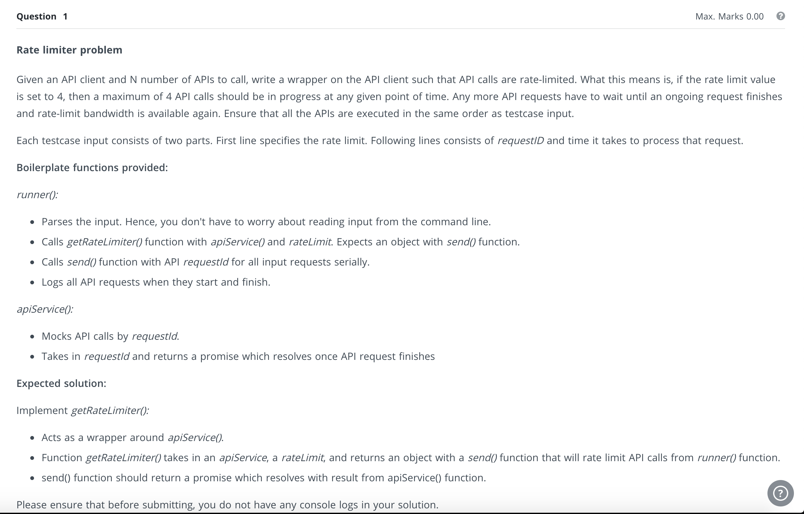
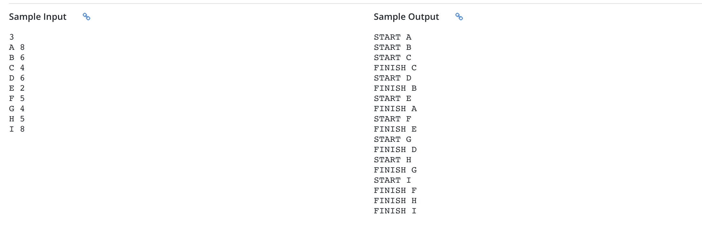

# api-limiter
Node scripts to limit api calls

## Execution

`npm i` to install dependencies

`npx nodemon ./rate_limiter.js localhost 8082` to run the script

## Problem statement

## Sample input

